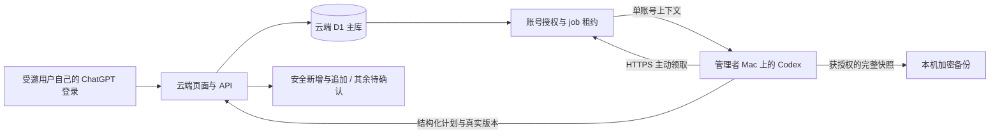

# 留白 v0.3：云端主库与本地 Agent

本文描述当前 v0.3 源码的架构与验收边界。代码完成不等于生产部署完成；受邀用户、机器凭据、真实云端处理与小时调度须分别验证。搭档共享、自有密码账号及 Dots 不在本轮实现范围。

## 身份和数据归属

首版保留 Sites 与平台托管的 ChatGPT 登录，只允许受邀账号访问。每个人使用自己的 ChatGPT 账号，同一账号在该 Site 内对应稳定身份；任务等记录仍以服务器取得的用户 ID 作为 owner。邮箱和显示名称不充当数据归属键。

`accountKey` 是 owner 派生的不透明分区标识，用于浏览器草稿、请求握手及 job 路由。它不是凭据，也不能用来替代服务器身份。浏览器写入携带 `X-Liubai-Account`，用于拒绝账号切换后仍在提交的旧页面。

| 入口 | 权威数据与身份 | 本机关闭后的行为 |
| --- | --- | --- |
| 云端浏览器、手机 PWA | Sites 身份；同一云端 D1 中按 owner 隔离 | 云端录入与手动编辑不依赖管理者 Mac |
| 本地远程整理 CLI | 平台机器通道＋应用机器凭据＋逐账号授权；只处理领取的 job | 整理暂停，待处理输入保留在云端 |
| 本地开发 `127.0.0.1:4178` | 回环本地身份；独立的 `.wrangler/state/` | 本地页面与 API 停止，已落盘数据保留 |
| GitHub | 版本化源码 | 不承载任务数据库、凭据或调度 |

不同受邀用户各自管理任务、原文、画像偏好和审核历史。登录不带来 ChatGPT 历史、日历或连接器权限；Site 邀请也不自动授予本机 Agent 整理权限。站点管理者仍有基础设施层面的数据库访问能力。

## 云端处理流程

本机 Agent 是处理端，不是第二个主库。它通过 HTTPS 出站请求，不需要开放本地端口。不同账号使用不继承历史的新 Agent 上下文；根调度不读取跨账号原文。

平台的 Sites 服务凭据只允许机器通过外层门禁，不产生用户身份。应用另校验机器 token 的服务端哈希；每个用户明确同意后，`organizer_grants` 才允许该账号被领取。整理和备份范围由服务器验证，撤销会提升授权代次，让旧租约失效；不能把机器请求伪装成登录用户。

`agent_jobs` 管理 20 分钟租约、授权代次、请求 ID 与完成回执。同一账号串行领取，重复请求复用原结果。上下文读取和最终写入都验证有效授权与租约；过期执行者不能继续写。任务 revision 阻止旧计划覆盖人工修改。提案仍由服务端判断是否属于安全追加；日期、重要性、紧急模式、完成状态、覆盖和删除需要本人确认。

本机冻结计划按账号及 entryId 保存在 `.liubai/accounts/ACCOUNT_KEY/plans/ENTRY_ID.json`，权限 600，内容绑定 source 与 accountKey；不随 job 到期重新生成，也不复制到 job 目录。新 context 的 frozenPlans 映射只列当前账号待处理输入对应的原计划。成功完整快照提供已 processed 且服务器有 plan_token 的输入清单；只有该 job 的 checkin 成功，才清理这些已安全落库并备份的计划。fail、无快照回执或仍 pending 的计划保留，后续成功检查可补清已完成项。

## 接口边界

| 接口 | 调用者与职责 |
| --- | --- |
| `/api/tasks` | 登录用户或回环本地用户；本人任务读写，写入检查账号握手与 revision |
| `/api/organizer` | 本人提交原文、修改偏好、确认建议、启用或撤销本人授权；本地整理命令保留 |
| `/api/agent/jobs` | 机器专用；queue、claim、context、renew、plan、resume、status、snapshot、checkin、fail |
| `/api/backup` | 当前用户完整快照；机器快照通过获授权 job 获取 |
| `/api/import` | 当前登录用户预览与确认一次性任务导入；不授予机器导入权限 |

服务端共享整理业务校验，浏览器与机器使用不同认证入口。不能通过删除 local403、接受任意 owner 或伪造 `oai-authenticated-user-*` 请求头代替机器权限体系。

八张应用表为 `tasks`、`spaces`、`inbox_entries`、`task_changes`、`organizer_profiles`、`organizer_grants`、`agent_jobs`、`task_imports`。`spaces` 仍只是初始化标记，不是情侣或团队成员模型。

## 保存、离线与日期

用户保存成功表示当前 API 已确认写入；Agent 是否完成整理另有最近检查状态。浏览器刷新只读取当前后端，不是本地与云端同步。按账号隔离的标签页草稿可帮助连接恢复，但没有离线写入队列；关闭标签页仍可能丢失未保存内容。

在线 PWA 提供手机主屏幕入口，不承诺离线编辑、推送提醒或后台手机计算。Mac 离线时云端输入继续保存；恢复后重新领取积压工作，不保证重放每个错过的定时时刻。

`due` 是唯一计划日期；统一读取 `due || deadline` 兼容旧字段，修改/清空日期时同步已有 alias。新建非紧急任务默认 `auto`，按账号时区与自然日计算，默认距计划日期不超过 3 天即紧急，包含当天和逾期；无日期保留象限，已完成任务不升档，重要性不变。`manualUrgent/manualNormal` 及旧任务缺失模式的安排优先。任务与验证后的紧急度偏好在同一账号响应中读取，避免先用默认值展示。

## 备份与恢复边界

完整快照在同一 D1 batch 中读取本账号全部应用表，不受页面列表条数限制，包含软删除、版本、历史和导入映射。快照携带表计数、账号绑定及规范 JSON 校验和。业务水位排除授权/job 运行状态，以及画像表的 last_check/last_result；内容没变时不因心跳再生成文件。

页面导出为明文 JSON；机器备份使用 AES-256-GCM。机器文件先写入并解密校验，再记录水位，保存在 `.liubai/backups/`。根调度在 queue 前运行全局 prune，只看受管 64 位十六进制目录中的文件时间，不读取快照正文、不跟随符号链接，也不清理 before-upgrade 原库备份目录。超过 30 天的快照与过期水位被清理，包括最后一份和已撤销账号的文件；下次获授权检查会重新保存快照，离线期间的清理等待下次在线。密钥单独安全保管，配置中的平台 token、应用 token 与备份密钥不写入快照；快照内的授权及租约状态不直接恢复启用。

单份机器快照的明文上限为 32 MiB，加密信封读取上限为 44 MiB，以容纳 base64 膨胀；超过明文上限时写入前报错，不推进水位。普通安全配置文件仍使用原 32 MiB 读取限制。

当前恢复工具只在新建临时 SQLite 中演练：固定表列和主键，恢复六张业务表（含 task_imports），核验内容、计数与 SQLite 完整性；不恢复 organizer_grants、agent_jobs，不改运行中的本地库或云库。它不能替代生产恢复验收。正式恢复还需要暂停写入、保存恢复前快照、核对账号和结构版本、处理租约与授权失效，并验证切换后的读写。

“有变化每小时快照”的执行者仍在 Mac。关机、App 退出、断网或凭据失效会停止备份，不能承诺全天候一小时恢复点。D1 原生导出与 Time Travel 的 Sites 控制面和权限尚需验证，不能把 Cloudflare 产品能力当成本项目已可用的恢复入口。

## 一次性本地任务合并

先保存完整本地快照和目标账号云端快照，再生成绑定 accountKey、稳定 sourceId 与 batchId 的任务文件。只导入未删除任务，包含已完成；本地原文、偏好与历史不自动上传。

登录目标账号后，`/api/import` 以当前云端数据生成冻结预览：新增项可插入，重复差异进入待确认，不覆盖既有任务。确认时再次检查目标任务版本；版本冲突后以新 batchId 生成预览，失败时保留来源文件和本地库。task_imports 保存来源映射与批次回执，重复导入不制造副本。此过程不建立数据库文件同步。

## 后续设计与发布前置

搭档体验仍为后续规划：两个独立身份，以“我的 / 对方的 / 我们的”切换；双方可主动开放自己的未完成任务供对方只读查看，共享空间另设成员与编辑权限。分享个人任务不默认分享原文、偏好和历史。当前未实现这些权限与界面。

留白自有密码账号、外部身份提供方、Dots、全天候云端执行与日历集成均需先核实支持路径及授权边界。不能因名称相似或已有登录就推断连接权限。

发布保留当前受邀范围，复用既有 Sites 项目。使用受支持的构建链携带数据库迁移；构建工具不可用时先解决构建与发布条件，不以运行时建表、公开站点或替代项目绕过。GitHub 推送和页面文档更新均不代表生产部署成功。

## 参考

- [Sites：访问范围、身份与托管](https://learn.chatgpt.com/docs/sites)
- [本地定时任务的运行条件](https://learn.chatgpt.com/docs/automations?surface=app)
- [D1 batch 的事务行为](https://developers.cloudflare.com/d1/worker-api/d1-database/#batch)
- [D1 导入导出](https://developers.cloudflare.com/d1/best-practices/import-export-data/)
