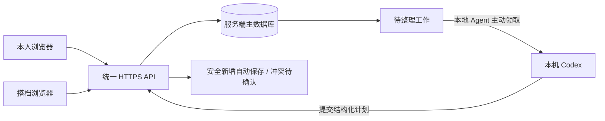

# 留白：当前架构与搭档模式规划

本文区分已实现的行为和待实现的设计。搭档空间、独立账号和远程 Agent 通道尚未上线。

## 当前的数据边界

| 入口 | 运行与数据位置 | 身份 | 本机关闭后的影响 |
| --- | --- | --- | --- |
| 本地 `127.0.0.1:4178` | 本机 Node/Vite；`.wrangler/state/` 中的持久数据库 | 仅回环可用的本地身份 | 页面和本地整理服务停止，已落盘数据保留 |
| Sites 线上站点 | 托管 Worker 与站点 D1 数据库 | Sites 提供的 ChatGPT 用户身份 | 线上服务不依赖本机，但本地整理不会处理线上输入 |
| Codex 定时整理 | 本机 Codex 调用本地整理 CLI | 固定本地空间 | 需要电脑和应用运行，恢复后仍需服务可用 |
| GitHub | 版本化源码 | GitHub 开发者账号 | 不承载运行时数据库或定时任务 |

两套数据库相互独立。浏览器每 15 秒刷新当前后端的数据，不是本地与云端的同步协议。界面中的“已保存”只表示当前空间写入成功。

任务、原文、变更建议、整理偏好按 `owner` 隔离；现有 `spaces` 表只是初始化标记，没有空间成员关系。云端使用相同 ChatGPT 账号会进入相同数据身份，不能据此区分两位搭档。登录不会自动获得 ChatGPT 历史、日历或其他应用的数据，也不会自动备份本地数据库。

## 建议的搭档体验

建立两个独立的应用账号，通过一次性邀请关联；不要求双方都订阅或使用 Codex。保留同一套四象限、时间视图和收件箱，用“我的 / 对方的 / 我们的”切换范围。

| 数据范围 | 本人 | 搭档 | 整理 Agent |
| --- | --- | --- | --- |
| 个人空间 | 完整管理 | 默认不可见；本人主动开放未完成任务后可只读查看 | 仅在本人授权的范围内处理 |
| 私人原文、偏好、历史 | 本人可见 | 分享任务不自动分享这些内容 | 只领取必要上下文 |
| 共享空间 | 双方可编辑 | 双方可编辑 | 需共享空间明确授权；保留作者与操作记录 |

邀请需对方接受，可撤销关联；撤销后立即失去相应访问权限。个人建议由本人审核，共享建议由拥有编辑权的成员审核并记录操作者。公开链接只提供入口，不赋予数据访问权。服务器管理员仍具备运维层面的数据库访问能力。

## 推荐的数据流

以服务端数据库为唯一权威来源。本地 Agent 是可离线的处理端，不是第二个主库。电脑关闭时网站仍可录入和手动编辑，待整理工作留在服务端；电脑恢复后继续领取。搭档只需浏览器，不需要安装 Codex。原文会交给模型处理，应向提交者清楚说明并征得相应空间的授权。

现有 `plan/resume/checkin` 仅允许本地执行，不能通过移除该限制或伪造身份头来开放远程处理。需要增加可撤销、限用户与空间的设备凭据。保留基于任务 revision 的冲突检查；增加工作租约、操作幂等 ID、结果回执和审计。每个空间初期串行整理，过期处理结果不得覆盖新的人工编辑。

不要在两台机器之间定时覆盖 SQLite 文件，也不要把整个私有数据库提交到 GitHub。需要离线编辑时，再增加按账号和空间隔离的草稿与 outbox；重连按操作 ID 和版本提交，冲突由用户选择。

## 部署选择

继续使用 Sites 可复用当前 Worker/D1，但独立登录与机器请求必须先确认平台支持的认证路径。不能把用于服务访问的凭据当成用户身份。

自建服务器则需要把 Cloudflare D1 绑定适配为独立数据库服务，并接入应用账号、HTTPS、会话与权限检查。两人初期可评估单实例 SQLite 的备份和并发边界；要扩展多个实例，优先评估 PostgreSQL。服务器的运行目录、磁盘与备份决定数据归属，tmux 不负责数据存储或同步。

tmux 可以让进程在 SSH 断开后继续运行，不能让关机后的程序继续运行，也不会自动负责崩溃恢复。正式部署使用受服务管理器管理的生产进程，并配置健康检查、备份及恢复演练。不要将 `npm run local` 的开发服务直接对外开放。

## 实施顺序

1. 确认部署平台与独立账号方案，验证 HTTPS 访问、机器请求和备份条件。
2. 建立账号、空间和成员模型；导入旧任务时保留原始输入、偏好、审核历史与映射记录，验证后再切换入口。
3. 实现邀请、个人任务只读授权和共享空间；用两位用户测试所有 API 的越权边界。
4. 接入本地 Agent 出站领取，验证关机积压、重试、租约过期和人工并发编辑。
5. 根据实际使用再增加离线编辑、日程与提醒。保持界面简洁，先避免两套主库同时写入。

## 参考

- [Sites：托管、数据库与身份](https://learn.chatgpt.com/docs/sites)
- [本地定时任务的运行条件](https://learn.chatgpt.com/docs/automations?surface=app)
- [D1 batch 的事务行为](https://developers.cloudflare.com/d1/worker-api/d1-database/#batch)
